# Hi there, I'm Yared Zenebe! 👋

## About Me 🧑‍💻

I'm a passionate **Computer Engineering student** with experience in **web development, machine learning, and digital circuit design**. I enjoy tackling complex problems, learning new skills, and building projects that merge creativity and logic.

- 🌱 Currently learning: **Next.js, advanced front-end techniques, machine learning deployment**  
- 🔭 Working on: **Multilingual Diabetes Risk Prediction ML system, interactive weather app**  
- 🌍 Languages: **Python, Java, C++, JavaScript**  
- 📫 How to reach me: **[yaredzbeth@gmail.com]**  
- ⚡ Fun fact: **uhmm...🤔 love hiking adventures in the UAE!**

## My Skills 🧠

## Featured Projects 💻

### [Weather App](https://github.com/YOUR_USERNAME/weather-app)

**Weather App** is a real-time weather application built with **React, Tailwind CSS, Leaflet.js, and Django**.  
It provides geolocation-based weather updates, interactive maps, and a smooth UI to enhance user experience.  
Check out the repository [here](https://github.com/YOUR_USERNAME/weather-app).

### [Diabetes Risk Prediction System](https://github.com/YOUR_USERNAME/diabetes-ml)

**Diabetes Risk Prediction System** is a **multilingual machine learning application** built with **Python, scikit-learn, and Flask**.  
It predicts early-stage diabetes risk and demonstrates my skills in **data preprocessing, model training, and web deployment**.  
Check out the repository [here](https://github.com/YOUR_USERNAME/diabetes-ml).

### [Gamify](https://github.com/YOUR_USERNAME/gamify)

**Gamify** is an interactive web application designed to **make learning and daily tasks engaging through gamification**.  
It’s built with **React, Tailwind CSS, and JSON-server backend**, featuring dynamic dashboards, rewards, and progress tracking.  
This project demonstrates my skills in **front-end development, state management, and building interactive UIs**.  
Check out the repository [here](https://github.com/YOUR_USERNAME/gamify).

## Get in Touch 📬

- **[LinkedIn](https://www.linkedin.com/in/yared-zewde/)**  
- **[Portfolio Website](https://YOUR_PORTFOLIO_LINK)**  
- **Email:** [yaredzbeth@gmail.com](mailto:yaredzbeth@gmail.com)

---

⭐️ *“Building my future one project at a time.”*
